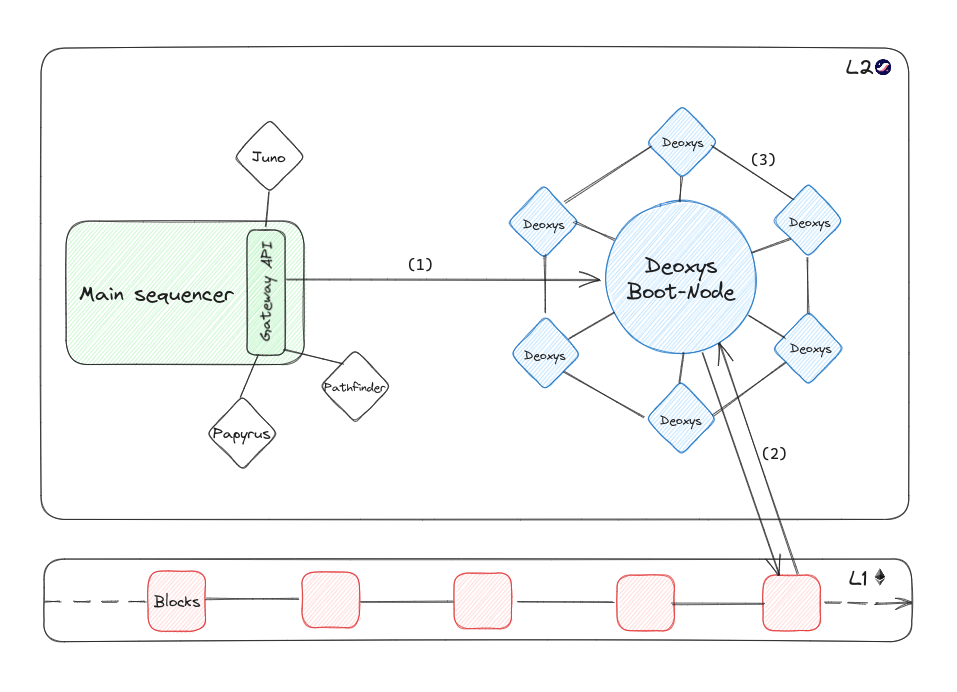

import { Callout } from 'nextra-theme-docs'

# Architecture
## Global operation

Here's a straightforward schematic representation of Deoxys, showcasing its dual role as a guardian of the Starknet state and its peer-to-peer state communication functionality. This feature reduces the reliance on requests to the sequencer and minimizes interactions between full node clients and the Starknet network sequencer.

  

  <em>Diagram of the overall operation of the Deoxys p2p customer network :</em>

 

**Step (1):**
Synchronizing the Deoxys Boot-node with Starknet's current state

The initial stage of the process involves running a Deoxys boot-node with AUTHORITY status, establishing direct communication with the sequencer gateway. This gateway continuously retrieves blocks starting from the genesis block and stores subsequent states in its database. Once it reaches the latest block issued by the sequencer, it can efficiently query the sequencer as new blocks are produced.

**Step (2):**
Cross-chain verification

The validity of the blocks received is checked by means of a cross-chain verification on the Ethereum chain. This ensures that network nodes are not subsequently informed of a false status (*in progress*). 

**Step (3):**
P2p synchronization of Deoxys nodes from the Deoxys Boot-node

Once a boot-node is operational and its ports are open, an unlimited number of Deoxys clients can be initiated. These clients function similarly to the boot-node but with a distinction that they no longer communicate with the sequencer. Instead, they solely interact with one another. Each client continuously acquires the state by requesting it from its peers while also responding to queries from other nodes within the network.

## The Deoxys Runtime
### 1) The Starknet pallet

The core component of Deoxys is the `starknet` pallet. It provides a Starknet compatibility layer for Substrate.

This pallet, in addition to the **RPC** module, validates starknet-encoded transactions and
makes it possible to re-execute them and store the successive states.

### 2) Wrapper Block Strategy

You might be asking, how are we able to map Substrate blocks to Starknet blocks ?   
Well we use the [wrapper block](https://corepaper.org/substrate/wrapper/) method
first used by Parity in frontier, the EVM compatibility layer for Substrate.

> Wrapper block is a strategy in Substrate to allow it processing blocks that were not originally designed with Substrate in mind.

It does add a slight performance overhead but it's negligeable compared to other components of the runtime.
Substrate block are translated to Starknet blocks in the 'Deoxys' module, and then executed by the Starknet pallet.

### 3) Execution

The execution layer defines the way blocks are executed and state diffs are produced.
With Deoxys, blocks are executed and state diffs are produced using the [blockifier](https://github.com/starkware-libs/blockifier) by Starkware.

